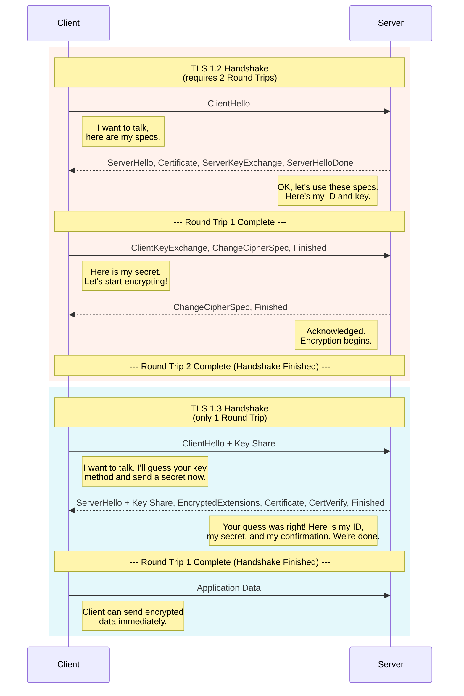
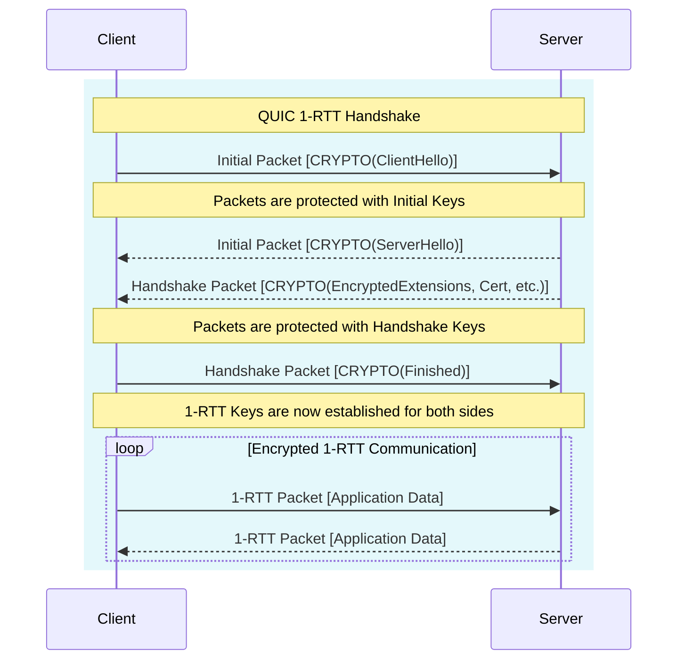
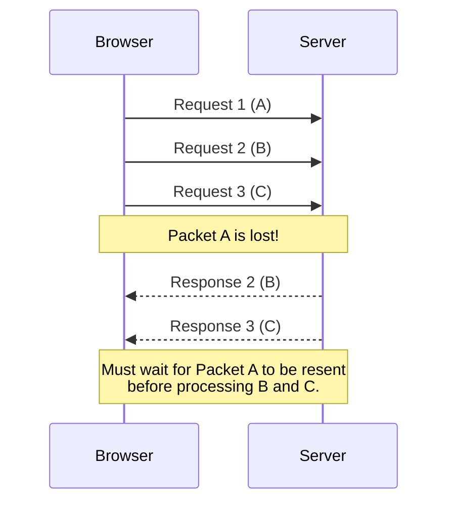
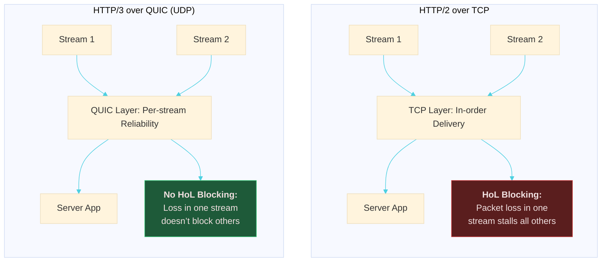

## History

In the early days of computer networks, devices simply communicated with each other sending files or anything over protocols like FTP, Gopher or telnet connections for remote access. Now this worked since the files were not interlinked to each other. At CERN, there were all these scattered documents hard to work with. Around 1990, Tim Berners-Lee at CERN proposed an idea that would have:
- HTML - the language we would use to write these interconnected files
- HTTP - the protocol we would use to work with these files, request or receive them
- URL - the addressing system for these linked files

This was the first version of http. It was so simple, it was called "one-line protocol" or HTTP/0.9 (dubbed later).

The first web server was CERN httpd running on a NeXT Workstation that only supported GET requests and only responded with raw HTML. The browser they used to work with this was called WorldWideWeb browser. (Kinda hard to believe the name came from here, also why name it this since they only uses it internally.. then again it's CERN so valid)

ARPANET was introduced before all this. Internet did exist in some form but was properly recognized around 80s. TCP/IP was adopted as the internet standard in 1983. So, this entire HTTP/0.9 thing worked over TCP/IP. 

HTTP did not re-invent anything, it worked on the existing stack TCP/IP.

This first version did not have anything like headers that we see in packets now. 
HTTP/1.0 introduced headers, status codes, MIME.
HTTP/1.1 introduced persistent connections, pipelining and chunked transfer encoding (RFC 2616 -- now RFC 9112)

The introduction of HTTP was a major shift in networking back then. It was machines sending files to one another and suddenly you could get any documents as long as they were in a server you could connect to. 

Now, this was the first version of something like this so naturally there were quite a few problems with this:

- Head of Line Blocking: Even with multiple requests, later requests had to wait on earlier ones.
- Too many TCP connections: To achieve parallelism, browsers opened multiple TCP connections -- more overhead
- Lack of any priority system or multiplexing: Important resources like CSS or JS files were treated the same as any other
- Repetitive Headers: each request had all the same headers.

As time passes, a lot of websites were getting heavier with pictures, scripts, styles, etc. that were hard for HTTP/1.x. They were hacky (domain sharding, inlining, etc.) to get around these limitations of HTTP/1.x

Google created SPDY around 2009 to experiment with multiplexing, header compression, prioritization, etc. This kind of paved the way forward to HTTP/2.

In 2015, the RFC 7540 specification for HTTP/2 was published and it soon gained traction across web traffic.

Improvements in HTTP/2 were:

- Binary Framing: Messages were encoded in frames and they had streams ids and types.
- Multiplexing: Multiple streams(requests/ responses) can exist in a single TCP connection. 
- Header Compression: using HPACK. This has modifications to avoid any security issues
- Request Prioritization: Client can specify Important files and server can send them earlier.
- Server push: Servers can send files if it anticipates the need
- Reuse of Connections: One TCP connection per origin was enough as we now had multiplexing.

This was a great improvement but this also had its caveats:
- It still ran over TCP, concurrency was possible with multiplexing but packet loss and congestion in one connection degraded throughput even with multiple streams.
- A lot of browser and server implementations vary. Some modifications hurt more than they helped.
- Server push: hard to configure this properly. Waste of bandwidth if not done properly 
- Added Complexity: Latency penalties due to TCP, TLS handshakes, etc.

HTTP/2 had TCP + TLS separately integrated, this still had the problem of high RTT. Also, as mobile devices grew, they was a need to tackle higher packet loss, reduce latency and deal with varying connectivity.

Google started working on QUIC to integrate TLS more tightly and use UDP instead of TCP to deal with packet loss and connection migration. It started as an experimental protocol at Google named gQUIC initially. Google used this under the hood for some services to test things and improve. Slowly, IETF picked up QUIC and worked on standardizing it. The IETF QUIC diverged from Google's initial implementation to improve performance, security and other things. So the QUIC protocol we see now is greatly different from the one by Google.

HTTP/3 was already in development over QUIC around 2021 and it was standardized in 2022 (RFC 9114).

That was a lot of history. whew.

Before we dive into QUIC, let's briefly look at UDP and TCP and try to understand what we're trying to solve with each of them.

## how does TCP work?

This protocol powers most of today's internet traffic. It was made around the 70s when the primary goal for transmission was reliability. The hardware was not as developed so there was lot of packet loss, corruption, etc. TCP was made to deal with these issues.

It primarily aimed at providing reliable data transfer, ordered delivery, flow control(to ensure sender doesn't overwhelm receiver) and congestion control(to avoid overwhelming the network).

{: .right w="500" h="350"}

This uses a 3-way handshake to establish a connection. The sender sends a SYN packet, the receiver responds with SYN-ACK and then the sender sends an ACK back. This establishes a connection.

This means at least one full RTT (Round Trip Time) before any data can be sent.

The data transfer occurs as a stream of bytes with each byte having a sequence number. The receiver keeps sending back acknowledgements (ACKs) for the received bytes. If the sender doesn't receive an ACK within a certain time limit, it resends the packets. Hence, "reliable". The send rate is dependent on the ACKs received -- "flow control". If the network is congested, packets may be dropped, leading to retransmissions and reduced send rate -- "congestion control".

When the connection is no longer needed, it is terminated using a 4-way handshake. One side sends a FIN packet, the other side responds with an ACK, then sends its own FIN, and finally the first side responds with an ACK. For reading more about TCP, you can look into RFC 793.

Now, this worked brilliant and still does for most cases. But as the internet grew, we needed more speed, lower latency and better handling of packets for various reasons, especially with mobile devices.

This had Head of Line blocking issues. If a packet is lost, all subsequent packets have to wait until the lost packet is retransmitted and received. This can lead to significant delays, especially in high-latency networks. Also, your connection would be tied to your IP address. Suppose you change from your home wifi to mobile data, your IP changes and you gotta establish a new connection.

There is another issue. TCP is deeply integrated into the OS kernels. This means any changes made to TCP would need OS updates. Now, this might seem trivial but there are a lot of devices out there and we would need change the server implementations, each mobile device OS, your PC OS, etc. separately. The data flow in the internet involves a lot of intermediate devices that would also need to understand these changes.
This would take decades to roll out any major changes. TCP has surely has evolved over time but not as fast as we would want it to.

## how does UDP work?

This is one of the simplest protocols out there. There are no handshakes here, no retransmissions, no ordering, no congestion or flow control. We just send the packets! Applications that use UDP have to deal with all of this themselves. Each UDP packet has:
- Source Port
- Destination Port
- Length
- Checksum
- Data

That is just 8 bytes of headers compared to around 20 bytes in TCP headers. Hence, the OS doesn't wait for any acknowledgements or anything, it just sends the packets immediately. UDP treats data as discrete messages. 

UDP supports broadcasting and multicasting. Hence, useful for gaming, streaming, etc. This also gives the developer liberty to implement their own custom congestion control, etc. 

Since UDP doesn't enforce strict reliability or connection management, we can reimplement these behaviors in user space, allowing for faster iterative development.

## QUIC

QUIC - Quick UDP Internet Connections

This is a transport layer network protocol designed by Google and later standardized by IETF. It is built on top of UDP and aims to provide features similar to TCP but with lower latency and better performance.

QUIC worked upon UDP to implement reliability, congestion control, multiplexing, and connection migration. It deeply integrates with TLS 1.3 for security.

HTTP/2.x also had TLS integrated but it was separate from TCP. That increased the RTT. 

Let's discuss these things in detail.

### Connection Establishment

In HTTP/2.x we had one round trip for TCP handshake and another for TLS handshake. This meant at least 2-RTT before any data could be sent. Yes, they did also have another version called `TLS False Start` that allowed sending data after the first round trip but it was not widely adopted due to security concerns. This one assumed that the client and server had previously connected and had some cached information that can be establish a new one without a full handshake. So, practically, we still had to wait for 2-RTT at first connection and 1-RTT for subsequent connections.

The TLS handshake before TLS 1.3 looked like this:
```
Client ----> Server : ClientHello
Client <---- Server : ServerHello + Certificate + Key Exchange
Client ----> Server : Finished
Client <---- Server : Finished
```

In TLS 1.3, this was reduced to:
```
Client ----> Server : ClientHello
Client <---- Server : ServerHello + Certificate + Key Exchange + Finished
```




The question was if we have connected securely before, why not use that cached info again? When you complete a TLS 1.3 or QUIC handshake for the first time, the server issues a session ticker or PSK (Pre-Shared Key) to the client. The client stores this information. When it wants to reconnect, it sends a `ClientHello + PSK`. The server checks if it recognizes the PSK and if valid, it can skip the full handshake and proceed directly to secure communication. The first data packet from the server carries both handshake info and encrypted application data.

QUIC combines the TCP handshake and TLS handshake into a single process. So 1-RTT is enough to establish a secure connection and send data. If client reconnects to the server, well, 0-RTT since the client had cached information from previous connections. This achieved true 0-RTT for subsequent connections.



#### 0-RTT Cryptography

When a normal TLS 1.3 handshake happens, both client and server derive a master secret from the key exchange. 

HKDF - HMAC Based Key Derivation Function: `HKDF(handshake_secrets)` -- RFC 5869 and RFC 8446.

From this master secret, the server creates a resumption secret and sends it to the client as part of the session ticket. The ticket is opaque to the client.

When the client wants to reconnect, it sends a `ClientHello` with the resumption secret. The server checks if it recognizes this secret and if valid, it derives the same master secret using the resumption secret. Both sides derive the early traffic keys using HKDF and the client can start sending 0-RTT encrypted data immediately. Meanwhile, the normal TLS handshake also continues in the background to establish fresh keys for future communication.

So, here the first data packet uses the older keys. If an attacker had recorded the previous session, they could replay this packet to the server. This is called a replay attack.

### Multiplexing and Streams

In TCP, if a packet is lost, all subsequent packets have to wait until the lost packet is retransmitted and received. It is called `Head of Line Blocking`. This can lead to significant delays, especially in high-latency networks. We did not have any kind of prioritization either. We could not send important files like CSS or JS earlier than others that could be pre-processed.



HTTP/2 tried to solve multiplexing at the application layer but it still used TCP underneath, so it was limited by TCPs (transport layer) Head of Line (HoL) Blocking.

QUIC solves this by using UDP as its foundation. Since UDP doesn’t guarantee order or reliability, QUIC can implement its own lightweight reliability and retransmission per stream.

In QUIC, there are multiple streams within a single connection. Each stream can be independently managed. If a packet in one stream is lost, it does not block the delivery of packets in other streams. Meaning, we can deliver important files without waiting for lost packets in other streams to be retransmitted. We get parallel, isolated data flows in the same UDP socket. Here, the packet loss handling is done per stream, not per connection.



### Congestion Control and Loss Recovery

TCP works nice when managing congestion -- it slows down when it detects packet loss and speeds up when it doesn't. Now this is fine, but it does come with its flaws:

- TCP has limited feedback. It relies on ACKs to determine delay. The retransmitted packets have the same byte range and sequence numbers, this makes it difficult to distinguish between new and old data -- causes uncertainty in RTT estimation and congestion control.
- TCP's congestion control algorithms are not very adaptive to varying network conditions, especially in high-latency or lossy networks. This can lead to suboptimal performance.
- Inflexible congestion control: TCP's congestion control mechanisms are built into the kernel, making it difficult to experiment with or deploy new algorithms without OS updates.

QUIC addresses these issues by having things in user-space. We can plugin in algorithms like BBR, CUBIC, Reno, etc. and tune things without OS updates. Rapid iteration for the win!

In QUIC, every packet has a unique packet number. This removes the ambiguity in distinguishing between new and old data. QUIC also uses ACK frames that can acknowledge multiple packets at once, and include ACK delay -- providing more granular feedback about which packets were received successfully and which were lost. This allows for more accurate RTT estimation and better congestion control.

Loss detection would be done with packet number gaps, timeouts, etc.

This results in more consistent latency and throughput, hence less jitter.

### Connection Migration

TCP connections are tied to IP addresses. You would've seen this when you setup TcpStreams in any programming language. If your IP changes, you have to establish a new connection. This is a problem for mobile devices that switch between networks (WiFi to cellular). Establishing a new connection means doing the entire handshake process again along with the TLS handshake too!

In QUIC, connections are identified by Connection IDs rather than IPs. During the handshake, both the client and server exchange CIDs. Each endpoint can issue new CIDs to others for future path migration. 


Suppose you change your IP addresses. The server sees this:
```
Old path: 192.168.1.22:50000 → 142.250.190.78:443
New path: 10.24.90.11:53012 → 142.250.190.78:443
```

The server will not trust this as this could a spoofed IP, old path might still be alive, congestion control metrics might be different, etc. So we need to validate it. When the client sends packets from a new IP address, the server doesn't trust it immediately. It sends a `PATH_CHALLENGE` frame to the new address. The client must respond with a `PATH_RESPONSE` frame. This verifies that the client controls the new address. Once verified, the server updates its routing to use the new IP for that connection.

Spoofed IP is something like you modify the IP address in the packet headers to appear as if they are going from someone else. You don't have the actual IP or anything you just wrote it. The server could easily validate by requesting an echo from the new IP. That's exactly what is going on here.

If you think about Man-in-the-Middle attacks, this could be a problem. An attacker could intercept your packets and send their own `PATH_CHALLENGE` to the server. The server would then send a `PATH_RESPONSE` to the attacker, who could then forward it to you. But this means the attacker is already intercepting and modifying traffic, no transport protocol can prevent that. You data is still safe though thanks to TLS 1.3.

### TLS Integration

In TCP + TLS, they are separate layers. TCP handles the transport and TLS handles the security. This introduced additional RTTs and complexity.

in QUIC, most of the packet header and payload is encrypted using TLS 1.3. This means that QUIC packets are protected from eavesdropping and tampering. The encryption is done at the transport layer itself, reducing the number of round trips needed for secure communication. Since, a lot of the connection is encrypted, it is harder for middleboxes (firewalls, routers, etc.) to interfere with the connection. QUIC packets appear as regular UDP packets to these middleboxes, reducing the chances of connection issues due to misconfigured or outdated middleboxes. This resistance to protocol `ossification` is a key design goal of QUIC.

## HTTP/3

This is the latest version of the HTTP protocol that runs over QUIC. It inherits all the benefits of the QUIC as described above. It uses the same request/response model as HTTP/1.x and HTTP/2 but with improved performance and security. So here we get:
- Reduced Latency: 1-RTT connection establishment and 0-RTT for subsequent connections.
- Multiplexing without HoL Blocking: Independent streams within a single connection.
- Improved Congestion Control: More accurate RTT estimation and adaptive algorithms.
- Connection Migration: Seamless switching between networks without dropping connections.
- Built-in Security: TLS 1.3 integration for encrypted communication.
- Drop-in Replacement: Designed to be a drop-in replacement for HTTP/2, making it easier to adopt.


QUIC and HTTP/3 don't really re-invent anything new, they are built upon existing concepts but with more granular fine-tuning.
At the time of writing this, HTTP/3 is supported by all major browsers and many CDNs and web servers. Around 30-40% of web traffic is now over HTTP/3.

What do you think about all of this? 